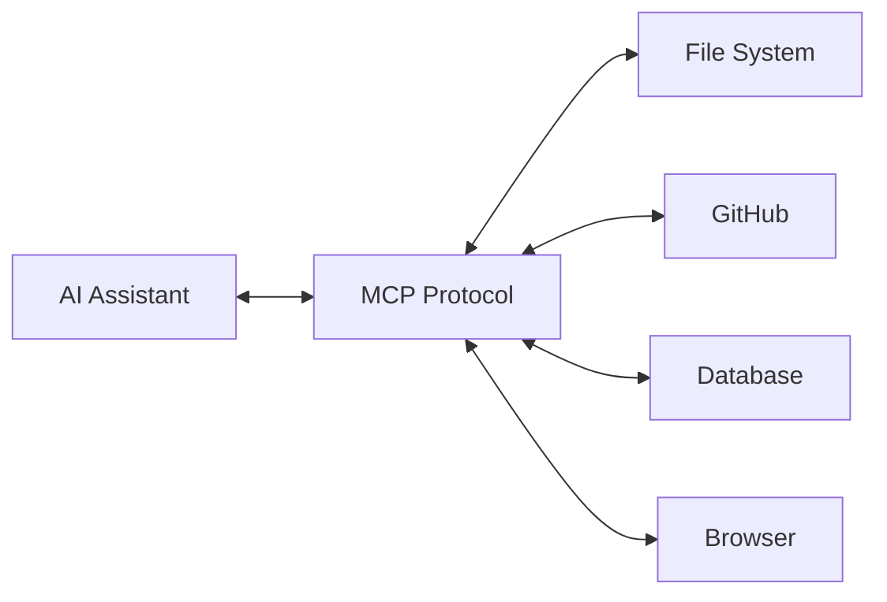

# MCP Power Pack

**50+ Ready-to-Use MCP Server Configurations & AI Agent Tools**

[](LICENSE)

> Stop configuring. Start building.

MCP Power Pack is a curated collection of pre-configured MCP (Model Context Protocol) servers, Cursor IDE rules, and AI agent skills. Everything you need to supercharge your AI coding workflow — zero configuration headaches.

---

## What's Inside

### Free Tier
| Item | Description |
|------|-------------|
| Browser MCP | Web browsing & scraping via Playwright |
| GitHub MCP | Repository management & API access |
| Notion MCP | Notion workspace integration |

### Pro Tier ($19)
| Category | Count | Contents |
|----------|:-----:|----------|
| MCP Servers | 20+ | Browser, GitHub, Notion, Filesystem, Fetch, Slack, Discord, Database, Redis, Docker, Kubernetes, AWS, GCP, Stripe, Supabase, PostgreSQL, MySQL, SQLite, Redis, Elasticsearch |
| Cursor Rules | 15+ | AI coding rules, context management, multi-file editing, test generation, documentation, security review |
| Agent Skills | 19 | Code reviewer, data analyst, debugger, content creator, decision helper, fact checker, fullstack developer, UX designer, project planner, meeting notes, email drafter, technical writer, academic researcher, strategy advisor, editor, deep research, sprint planner, python expert, visualization expert |
| Multi-Agent Router | 1 | Automatic tool routing based on query classification |

### Quick Comparison

| Feature | Free | Pro ($19) |
|---------|:----:|:---------:|
| Basic MCP Servers | 3 | 20+ |
| Cursor Rules | - | 15+ |
| Agent Skills | - | 19 |
| Multi-Agent Router | - | Yes |
| Priority Support | - | GitHub Issues |
| Commercial License | Yes | Yes |

---

## Quick Start

### Prerequisites
- Node.js 18+ (for MCP servers)
- Cursor IDE or Claude Desktop (for rules)
- Python 3.10+ (for agent skills, optional)

### 1. Clone
```bash
git clone https://github.com/bambooshadow-studio/mcp-power-pack.git
cd mcp-power-pack
```

### 2. Install MCP Servers
```bash
# Install individual MCP servers as needed
npx @modelcontextprotocol/server-browser
npx @modelcontextprotocol/server-github
```

### 3. Configure Cursor
Copy the `pro/cursor-rules/` folder into your Cursor IDE:
```bash
cp -r pro/cursor-rules/* ~/.cursor/rules/
```

### 4. Configure Claude Desktop
Edit your `claude_desktop_config.json`:
```json
{
  "mcpServers": {
    "github": {
      "command": "npx",
      "args": ["-y", "@modelcontextprotocol/server-github"]
    },
    "browser": {
      "command": "npx",
      "args": ["-y", "@playwright/mcp@latest"]
    }
  }
}
```

---

## What is MCP?

Model Context Protocol (MCP) is an open standard that connects AI assistants (like Claude, Cursor) with external tools and data sources. Instead of building custom integrations for every tool, MCP provides a universal protocol:



With MCP Power Pack, you get all these connections pre-configured and ready to use.

---

## Pro Tier

Get the full power pack — 50+ configurations, 19 agent skills, and multi-agent routing.

👉 **[Purchase Pro Tier — $19](https://github.com/sponsors/bambooshadow-studio)**

What you get:
- Instant access to private pro repository
- All MCP server configurations
- 15+ Cursor rules for AI-assisted development
- 19 production-ready agent skills
- Multi-agent router with automatic tool assignment
- Priority GitHub Issues support

---

## Documentation

| Document | Link |
|----------|------|
| Terms of Service | [docs/TERMS_OF_SERVICE.md](docs/TERMS_OF_SERVICE.md) |
| EULA | [docs/EULA.md](docs/EULA.md) |
| Privacy Policy | [docs/PRIVACY_POLICY.md](docs/PRIVACY_POLICY.md) |
| Refund Policy | [docs/REFUND_POLICY.md](docs/REFUND_POLICY.md) |
| Cookie Policy | [docs/COOKIE_POLICY.md](docs/COOKIE_POLICY.md) |

---

## License

Free tier: MIT License  
Pro tier: See [EULA](docs/EULA.md)

Built with components from [awesome-llm-apps](https://github.com/Shubhamsaboo/awesome-llm-apps) (Apache-2.0).

---

*Part of [BambooShadow Studio](https://github.com/bambooshadow-studio)*
